#Art.com Responsive CSS Extensions

The following is a collection of CSS classes which add responsive behaviors to existing CMS content (markup patterns) already in use on Art.com.

These classes are implemented as high-level extensions such that a web designer should be able to easily add responsive behaviors to new and existing CMS content. After a brief initial tutorial, ongoing usage should not require extensive assistance from the technology group. 

These classes should be viewed as layout prototypes which are extended as new (responsive) module patterns are added over time.

##Development installation

_note: NPM is required._
cd to the root project directory and run...

    $ npm install

##Previewing with a local server

cd to the root project directory and run...

    $ node server.js

##Compiling .less

cd to the root project directory and run...

    $ gulp

This will start the less watcher and compiler -- which is configured to watch `styles.less` and compile this into CSS at `css/styles.css`

To exit...

    ctrl+c

##Client Installation

An example...

    <!-- MQ EXTENTIONS -->
        <meta name="viewport" content="width=device-width">
	    <link rel="stylesheet" type="text/css" href="css/styles.css" />
	    
    <!-- END MQ EXTENTIONS -->
*The code block above is required to enable the classes listed in this document.*

*NOTE: These files will need to be properly appended/mapped to a sensible production codebase location.*

##Implementation

An example...

    

	    

		    
	    

    

*In the above code block the `.heroBlock` class was added to the class list of the `#P2A_Sale` element.  With this class added the block now behaves responsively to media query changes.*  

##Class Definitions

###.responsiveContainer

A responsive container use to make outermost container 100 % so that inner container can resizes/re-crops

###.heroBlockCenter

To make sales content and background image to center align for different screen resolutions instead of resizing.

###.heroBlock

A hero image zoom that resizes/re-crops a static hero image.

_NOTE: Iterations of this class could, for example, load different images for different screen resolutions instead of resizing one single image as shown in this example. This is a prominent content type and it's likely that there will be many variants of this class in particular._

<table>
    <thead>
        <tr>
            <th>Phone 320h</th>
            <th>Tablet 568h</th>
            <th>Laptop 1024h</th>
        </tr>
    </thead>
    <tr valign="top">
        <td></td>
        <td></td>
        <td>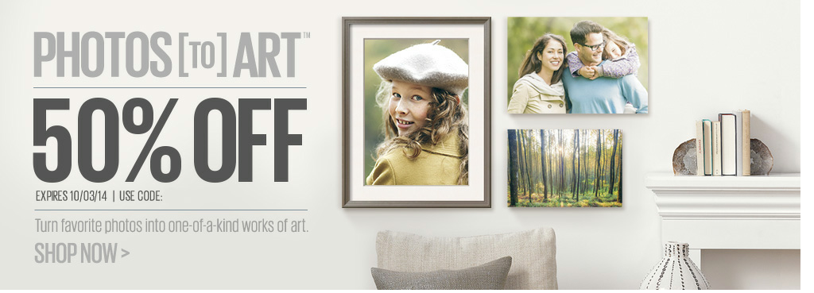</td>
    </tr>
</table>

### .oneByEight_categories

A single title and stacking subtitle displayed across the width of the outermost container with eight horizontally stacking content images.

<table>
    <thead>
        <tr>
            <th>Phone 320h</th>
            <th>Tablet 568h</th>
            <th>Laptop 1024h</th>
        </tr>
    </thead>
    <tr valign="top">
        <td></td>
        <td>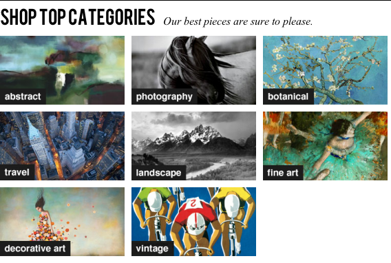</td>
        <td>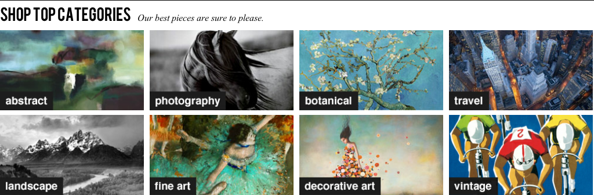</td>
    </tr>
</table>

### .fourStacked_feature

Four horizontally stacking content boxes – larger featured content.

<table>
    <thead>
        <tr>
            <th>Phone 320h</th>
            <th>Tablet 568h</th>
            <th>Laptop 1024h</th>
        </tr>
    </thead>
    <tr valign="top">
        <td>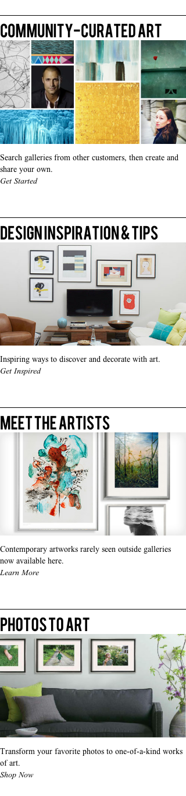</td>
        <td>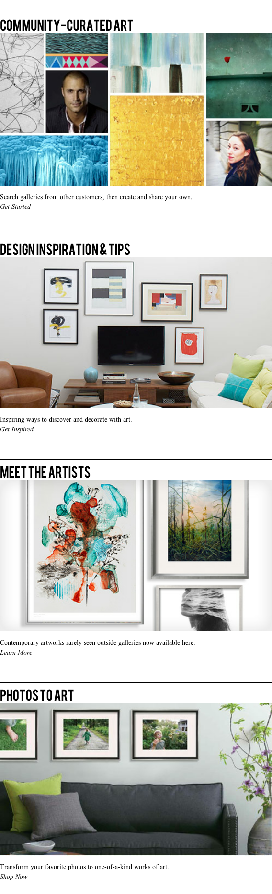</td>
        <td>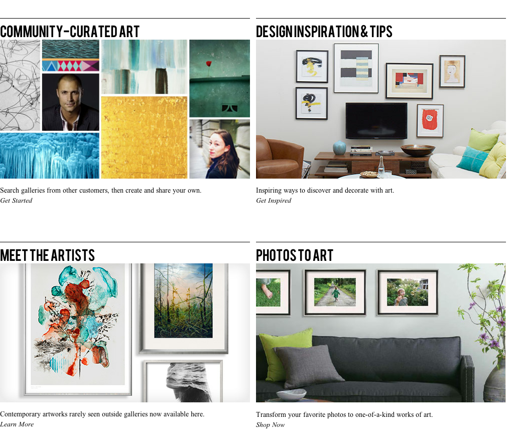</td>
    </tr>
</table>

### .fourStacked_subFeature

Four horizontally stacking content boxes – smaller sub-featured content.

<table>
    <thead>
        <tr>
            <th>Phone 320h</th>
            <th>Tablet 568h</th>
            <th>Laptop 1024h</th>
        </tr>
    </thead>
    <tr valign="top">
        <td>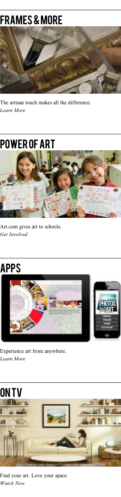</td>
        <td>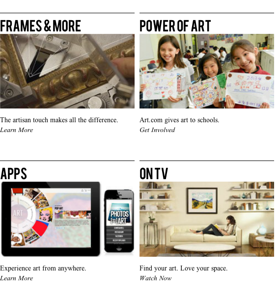</td>
        <td>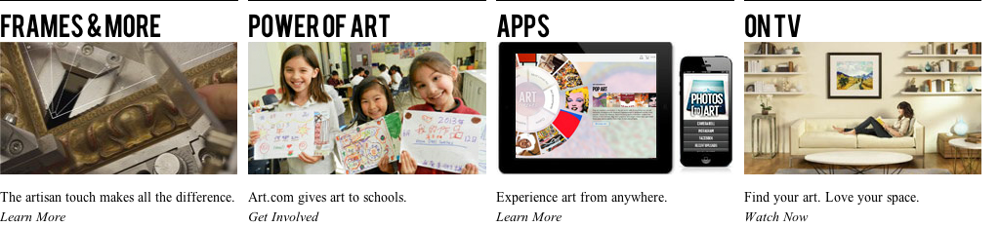</td>
    </tr>
</table>

### .responsiveFooter

Four horizontally stacking content boxes – smaller sub-featured content.

<table>
    <thead>
        <tr>
            <th>Phone 320h</th>
            <th>Tablet 568h</th>
            <th>Laptop 1024h</th>
        </tr>
    </thead>
    <tr valign="top">
        <td>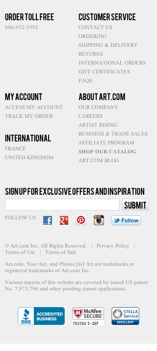</td>
        <td>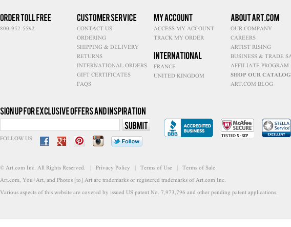</td>
        <td>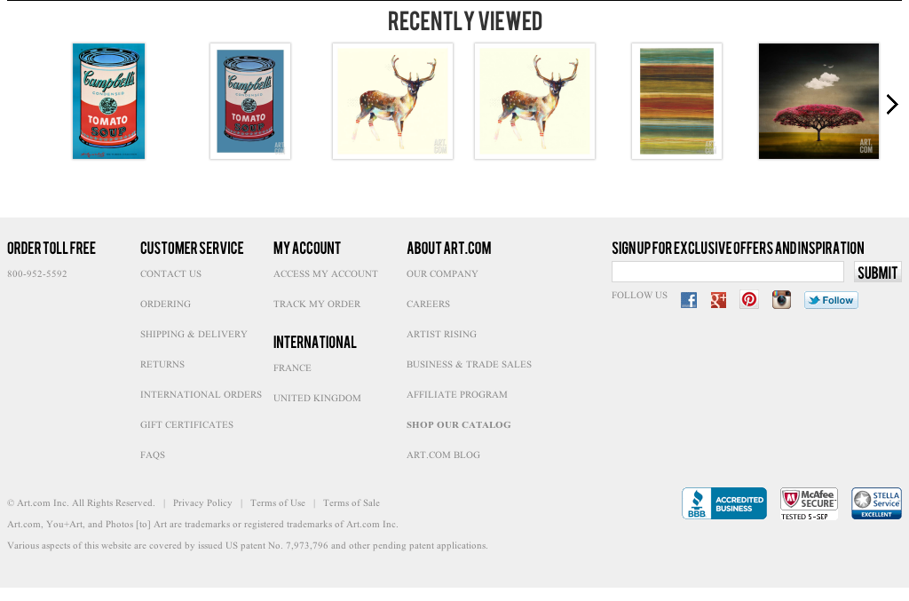</td>
    </tr>
</table>

### .responsiveHeader

Four horizontally stacking content boxes – smaller sub-featured content.

<table>
    <thead>
        <tr>
            <th>Phone 320h</th>
            <th>Tablet 568h</th>
            <th>Laptop 1024h</th>
        </tr>
    </thead>
    <tr valign="top">
        <td>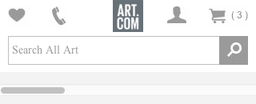</td>
        <td>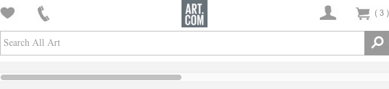</td>
        <td>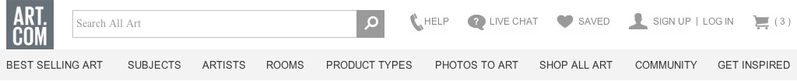</td>
    </tr>
</table>

### CDN and CMS Information

We need to add styles.css in cdn location. This is the file which has all the classes that's required to run responsive design website.

### CDN Path

e.g.

\\sac-cifs1\cdn_nonprod\dev\CI\applications\rDesign\styles.css

Note: The above CDN location will change according to envrionment (prod\Non-Prod).

### CMS Location to make homepage resposive design

Internal->Art->Master Pages->Default->default-1 file

Note: This is temporary location to homepage only, we have to add css and js to common place and as per new content so that we don't need to make changes on every single page.

### Global CSS and meta file 
<meta name="viewport" content="width=device-width">
<link rel="stylesheet" href="/cdn/dev/ci/applications/rdesign/styles.css" type="text/css" />

Note: We need to add the above script in CMS global css, meta tag is required to run resposive design in ipad and iphone.

### Global Script (Added at bottom of the page)

// rdesign artmqExtension.js content for responsive design
$(function() {
$('.home-feature-div-l,.home-feature-div-r,.hdr_top_nav').attr('style','')
$('#skinny-banner-container').attr('style','')
});

$('#hdr-new-container').addClass('responsiveHeader');
$('#P2A_Sale').addClass('heroBlock');
$('#2014_40Sale').addClass('heroBlockCenter');
$('#shop-top').addClass('oneByEight_categories');
$('#hot-products').addClass('heroBlock');
$("#home-feature-div-l,#home-feature-div-r").wrapAll("

");
$('#home-feature-cont').addClass('fourStacked_feature');
$('#home-subfeature').addClass('fourStacked_subFeature');
$('#ftr').addClass('responsiveFooter');
$('#main').addClass('responsiveContainer');
$('.my-account-logged-in.hidden.link').css('display','none');
$('#200under').addClass('holidayBlock');
// rdesign artmqExtension.js content for responsive design

Note: We have injected css temporary using jquery but later we have to add in every single CMS content page.

